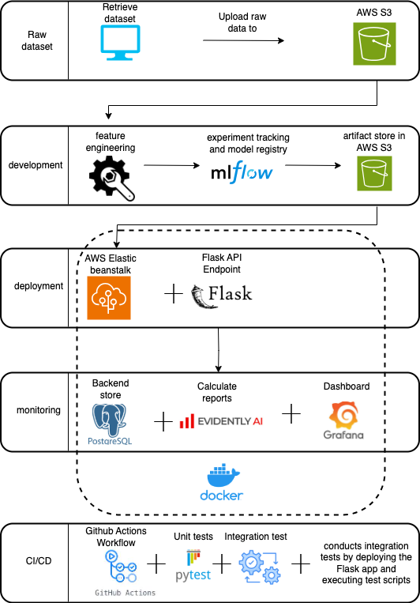
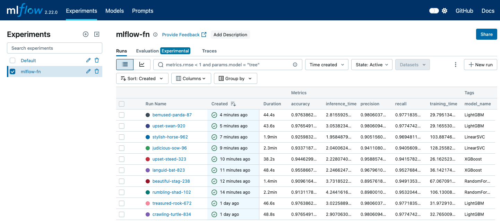
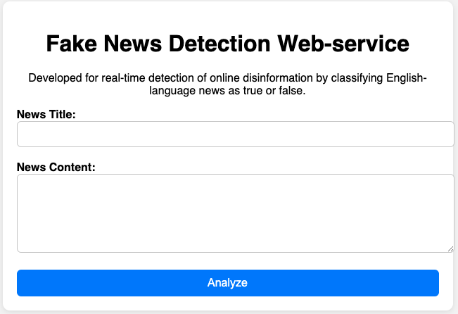
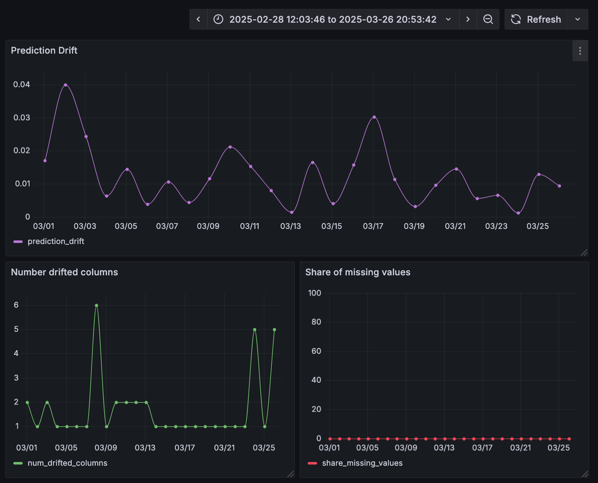

# Fake News Detection Web-service - MLOps End-to-End-Project


This project addresses the growing challenge of online disinformation by providing a web-based tool to detect fake news. Built with Flask, the service uses a supervised machine learning model (LightGBM) and natural language processing techniques to classify English news articles as real or fake. It also provides a probability score to indicate prediction confidence.

# Proposed solution and how this tool is working to address disinformation

A web-based service is used to combat online disinformation. This tool is designed to assist information consumers, researchers, and journalists in navigating today's complex digital landscape. Utilizing natural language processing and supervised learning, it detects and differentiates between factual and false information. The goal is to enhance public awareness, helping users identify potential disinformation. By doing so, the tool empowers individuals to critically assess the credibility of the information they encounter online.

The fake news detection web-service is built using Flask, a web application framework for Python, as the backend server. The server processes user input, specifically the text of a news article, and passes it through a machine-learning model to determine whether the news is real or fake. To provide transparency, the model also outputs a probability score, ensuring users understand that predictions are not always absolute. The service is deployed using AWS Elastic Beanstalk, which manages the infrastructure, scaling, and deployment of the application. The web service can also be tested using a user interface built with Flask, running on a development server.

To enhance accuracy, standard natural language processing (NLP) techniques were applied to preprocess the text, including tokenization and stopword removal. Additionally, new numerical features were created and used a Bag-of-Words (BoW) vectorizer to convert textual data into a numerical format for machine learning. The fake news detection web-service was trained using a dataset of English news articles, meaning the web service is specifically designed for analyzing English-language content. While the underlying techniques could be adapted for other languages, its current implementation is optimized for detecting disinformation in English news articles. The model employed for classification is LightGBM. Even if it is a lightweight model, it still achieves a decent precision and recall score of 98% in detecting fake news.

The goal is to support journalists, researchers, and the public in critically assessing the credibility of online information.

# Video presentation

You can find a brief presentation of the project in the video below.

<a href="https://vimeo.com/1094975444/138631dd42?share=copy" target="_blank">
  
</a>

# About the Dataset

(WELFake) is a dataset of 72,134 news articles with 35,028 real and 37,106 fake news. For this, authors merged four popular news datasets (i.e. Kaggle, McIntire, Reuters, BuzzFeed Political).

The Dataset contains four columns: Serial number (starting from 0); Title (about the text news heading); Text (about the news content); and Label (0 = fake and 1 = real). There are 78098 data entries in csv file out of which only 72134 entries are accessed as per the data frame.

Published in:
IEEE Transactions on Computational Social Systems: pp. 1-13 (doi: 10.1109/TCSS.2021.3068519).

# Tech Stack

* **scikit-learn:** Core library for building and training the fake news classification model.
* **MLflow:** Used for tracking experiments, model registry, and reproducibility.
* **hyperopt:** Enables efficient hyperparameter optimization.
* **Amazon Web Service (AWS):** Used for data storage and model artifacts via S3.
* **Flask:** Lightweight web framework powering the backend API.
* **EvidentlyAI:** Monitors data and model performance to detect drift and quality issues.
* **PostgreSQL:** Stores metadata, logs, and model-related data.
* **Grafana:** Dashboard for monitoring system and model metrics.
* **Docker:** Containerizes the entire application for easy deployment and scalability.
* **Pytest, Pylint, black, GitHub pre-commit hooks:** Ensure code quality through unit testing, linting, and automatic code formatting.
* **Github Actions:** Automates continuous integration (CI) workflows for testing and quality checks.

# System architecture



**Text processing and feature pipeline**: A data pipeline that loads raw news data, cleans and enriches it by generating numerical and textual features, and prepares it for model training. It combines and analyzes text fields, extracts linguistic and statistical features, performs NLP-based text cleaning (lemmatization, tokenization, stopword and punctuation removal), and outputs a cleaned title_text_clean column. The processed dataset is then uploaded to an S3 bucket.

**Training pipeline:** This pipeline handles both initial training and retraining of classification models using preprocessed features from S3. It performs hyperparameter tuning with hyperopt, supports models like RandomForest, XGBoost, LinearSVC, and LightGBM, and uses a Bag-of-Words pipeline for text vectorization. This pipeline ensures reproducible, performance-driven model selection and versioning.

* Loads preprocessed data from S3
* Performs hyperparameter optimization
* Trains and evaluates multiple classification models
* Tracks all experiments, metrics, and artifacts with MLflow
* Measures and logs training and inference time
* Automatically registers the best-performing model
* In retraining mode, compares with the current production model and only registers a new one if it performs better (archiving the old model)

**Inference Pipeline:** A Flask-based web service that handles real-time inference for fake news detection. It processes incoming news text, loads a trained model from an S3 bucket, and returns a prediction label ("fake news" or "real news") along with class probabilities.

* Flask API endpoint for serving predictions via requests
* Preprocesses input text to match model-ready format
* Loads the latest registered model from S3
* Performs inference and returns classification results
* Outputs both predicted label and class probabilities

**Monitoring Pipeline:** A batch monitoring pipeline that tracks model and data quality over time using EvidentlyAI, stores computed metrics in a PostgreSQL database, and visualizes them with Grafana. It evaluates model performance and data drift daily using held-out labeled data, ensuring long-term model reliability.

* Batch Monitoring with EvidentlyAI for drift, missing values, and classification metrics
* Loads reference and validation data from S3 for comparison
* Predicts using the production model loaded from S3 (via MLflow)
* Calculates daily metrics like accuracy, precision, recall, drift score, and missing data share
* Stores results in PostgreSQL using a time-series structure
* Supports backfilling to retroactively monitor historical data
* Dashboards powered by Grafana for visualization and analysis
* Automatic table creation for metric storage if missing

**CI-Tests:** GitHub Actions workflow that runs on pushes and pull requests to the develop branch. It sets up a Python environment, installs dependencies, runs unit tests with Pytest, performs linting with Pylint, and conducts integration tests by deploying the Flask app and executing test scripts. AWS credentials are configured for secure access to required resources.

# Getting started

Follow these steps to set up and run the project locally:

Clone the repository

<pre><code>git clone https://github.com/katjaweb/mlops-fake-news-prediction.git
cd mlops-fake-news-prediction</code></pre>

Make sure you have docker and anaconda installed. For this project anaconda Version 24.10.1 and docker 27.5.1-1 were used. You also need AWS CLI to run this project.

To install Ananconda distribution follow the instructions here:

[[https://www.anaconda.com/docs/getting-started/anaconda/install](https://www.anaconda.com/docs/getting-started/anaconda/install)]

If you want to install the same distribution, download anaconda Version 24.10.1

```bash
wget https://repo.anaconda.com/archive/Anaconda3-2024.10-1-Linux-x86_64.sh
```

and execute

```bash
bash Anaconda3-2024.10-1-Linux-x86_64.sh
```

The AWS CLI install and update instructions can be found here:

https://docs.aws.amazon.com/cli/latest/userguide/getting-started-install.html

**Install dependencies**

Install required dependencies.

```bash
make setup
```

The make setup command prepares the local development environment by installing all required dependencies, enabling code quality checks, configuring permissions for integration tests, and setting up AWS credentials. Specifically, it installs development packages using Pipenv, sets up Git pre-commit hooks for linting and formatting, makes the integration test script executable, and initializes AWS CLI configuration for accessing cloud resources.

**Download required NLP model**

```bash
pipenv run python -m spacy download en_core_web_sm
```

You need to create an S3 bucket to store the datasets and artifacts used for experiment tracking. To do this, you can run the following command. Please note that your bucket name must be unique and cannot be the same as the one used in the project. To ensure uniqueness, you can append your name to the bucket name in the command. You may also modify the region to one of your choice.

```bash
aws s3api create-bucket --bucket fake-news-prediction-katja --region eu-west-1 --create-bucket-configuration LocationConstraint=eu-west-1
```

Next open `config/vars.yaml` file and update the `[mlflow][model_bucket]` field to match the name of your S3 bucket.

**Retrieve the dataset**

You can download the dataset from the following link.

```bash
wget https://zenodo.org/records/4561253/files/WELFake_Dataset.csv
```

Then upload it to the S3 bucket you created earlier. Remember to replace the bucket name with your own unique bucket name.

 ```bash
aws s3 cp /workspaces/mlops-fake-news-prediction/WELFake_Dataset.csv s3://fake-news-prediction-katja/datasets/WELFake_Dataset.csv
```

**Run text processing and feature pipeline**

```bash
make run_process_data
```

The `run_process_data` Makefile command executes the `process_data.py` script located in the `01_development` folder. This script handles raw data processing, including feature engineering and text cleaning, saves the cleaned data to S3, and prepares it for model training.

**Run the training pipeline**

The `make start_mlflow` command starts an MLflow tracking server with a local SQLite database as the backend and an S3 bucket as the artifact store.

```bash
make start_mlflow
```

Then open a new terminal and execute the training script (`train.py`) to train a model and log its artifacts and metrics to the MLflow server.

```bash
make run_train
```



**Run the application locally**

To run the fake news prediction web service locally, start the Docker container to build and launch the service in the background.

```bash
docker-compose up fake_news_prediction -d --build
```

This will build the Docker image using `02_deployment/Dockerfile`, expose port `9696`, mount your local AWS credentials to the container and start the service using `gunicorn` on port `9696`

To verify the service is running, run the test script to send a sample prediction request:

```bash
python 02_deployment/test.py
```

This script sends a sample news article to the `/predict` endpoint and prints the response, including the prediction result.

**Deploy the app to AWS Elasstic beanstalk**

The EB CLI is listed as a development dependency in the Pipfile.
If you're deploying the Fake News Prediction Service for the first time, first adjust the AWS region in the deploy.sh script. Then navigate to the deployment directory:

```bash
cd 02_deployment/deploy
```

Next run the following command in your terminal:

```bash
./deploy.sh
```

If you run the script for the first time, a new Elastic Beanstalk environment will be created. Once the deployment completes successfully, Elastic Beanstalk will provide the service's endpoint URL. Make sure to update the `test_eb.py` script with this new address. It can then be used to verify that the service is working as expected.

```bash
pipenv run python 02_deployment/test_eb.py
```

On subsequent runs, the environment will simply be updated with the latest version of the application.

When the service is no longer needed, make sure to terminate the environment in order to avoid unnecessary costs.

```bash
eb terminate fake-news-env
```

The web service can also be tested using a simple user interface built with Flask, running on a development server. This setup allows for quick and interactive testing of the fake news detection functionality.

To start the UI, run the following bash command from the root directory:

```bash
pipenv run python 02_deployment/app_ui.py
```

This will launch the Flask development server on `http://localhost:5000`.



In `app_ui.py`, make sure to set the correct URL for the prediction API.

```bash
url = "http://localhost:9696/predict"
```

If the backend is deployed to AWS Elastic Beanstalk, replace it with your actual EB URL.

**Monitoring**

Launch the monitoring infrastructure and run the batch monitoring pipeline locally. This command will start the PostgreSQL database, Adminer (a DB UI), and Grafana for visualizing metrics.

```bash
make monitoring
```

This will build and launch the Docker containers (db, adminer, grafana) and run the 03_monitoring/monitoring.py script to calculate and store performance & data drift metrics such as prediction drift, number of drifted features or share of missing values.

The metrics can be visualized via Grafana (running on http://localhost:3000)
User: admin
Password: admin



TO access Adminer UI, go to http://localhost:8080. Use the following credentials:

System: PostgreSQL
Server: db
Username: postgres
Password: example
Database: test

This monitoring setup was created for documentation and demonstration purposes only.
It does not run in a live production environment.
A subset of the WelFake dataset is used to simulate model behavior over time and illustrate how data quality and prediction performance could be tracked in a real-world scenario.

**Run tests**

To run unit tests, simply enter the following make command

```bash
pipenv run pytest tests/
```

You can also run a Makefile target to run the integration test.

```bash
make run_integration_test
```

**Continious Integration (CI) Test**

The CI pipeline automatically runs a series of tests to validate the Fake News Prediction Service whenever changes are pushed to the `develop` branch or a pull request targets develop.

What the CI Pipeline Does:

- Checks out the repository on a clean Ubuntu environment.
- Sets up Python 3.12.2.
- Installs development dependencies using pipenv.
- Downloads the required SpaCy language model (en_core_web_sm).
- Runs unit tests using pytest.
- Runs code linting with pylint to check for style and code quality issues.
- Configures AWS credentials using secrets stored in GitHub Actions.
- Starts the model server locally using gunicorn.
- Runs integration tests located in the integration_test directory.

When the CI Pipeline Runs:

- On every push to the develop branch.
- On every pull request targeting the develop branch.

This ensures that all core functionality is tested and validated before merging into the main development line.

# Possible improvements and future developments

The current version of the Fake News Detection web-service utilizes a LightGBM classifier, a relatively simple machine learning algorithm. While it delivers decent accuracy, more advanced models could further improve performance. For example deep learning approaches, such as transformer-based neural networks (e.g., BERT or GPT) could be explored to enhance predictive reliability.
 
Currently, the Fake News Detector is trained on a dataset of English-language news articles. To increase its versatility, it could be extended to analyze other types of text, such as social media posts or blogs. This expansion would require retraining the model on new datasets specific to these domains, but it would significantly broaden its applicability in detecting misinformation across different platforms.
 
To make fact-checking more seamless, the Fake News Detection web-service could be integrated into news websites and mobile apps. This would allow users to assess the credibility of articles in real-time, helping them make more informed decisions about the content they consume and share. Such integration could be particularly useful for media organizations, journalists, and everyday readers alike.
